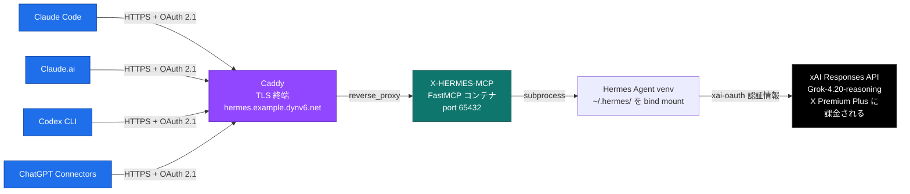

<p align="center">
  
</p>

# X-HERMES-MCP

[](https://modelcontextprotocol.io/)
[](https://x.ai/)
[](#クライアント接続)
[](#ライセンス)

> **X (Twitter) の個人調査用 MCP サーバ。Grok-4.x の `x_search` をバックエンドにした 6 ツールが、既存の X Premium Plus サブスクの範囲内で動く (従量課金なし)。**

**他の言語:** [English](README.md) · [日本語](README.ja.md)

OAuth 2.1 + HTTPS で **Claude Code / Claude.ai / Codex CLI / ChatGPT コネクタ** から呼べる前提で設計。自宅サーバに Caddy + Docker、DDNS サブドメイン越しに展開する構成。

---

## 30 秒で何ができるか

クライアント設定にこれを一行追加:

```json
{
  "mcpServers": {
    "X-HERMES-MCP": {
      "url": "https://your-host.example.com/mcp"
    }
  }
}
```

あとは AI に投げるだけ:

- *「このツイートの構造化メトリクスを取って」* → `fetch_tweet` が `{text, author, created_at, metrics, media, referenced_tweets, link_card, …}` を約 30 秒で返す
- *「今の日本のトレンドを根拠付きで」* → `get_trends` がカテゴリ付き・証拠 URL 付きランキングを返す
- *「このツイートの引用ツイートを 10 件サンプル」* → `get_quote_tweets`
- *「`@AnthropicAI` から `claude code` を過去 7 日で検索」* → `search_tweets` が `allowed_x_handles` / `from_date` / `to_date` を構造化パラメータで渡す
- *「このツイートを根とした引用チェーンを depth 2 で」* → `fetch_tweet_chain`
- *「スキーマ整形は要らない、引用 URL 付きで答えだけ」* → `x_search` (raw、最速)

リクエストは既存の xAI OAuth を経由して **xAI Responses API** に届くため、課金は **X Premium Plus の quota** に乗る。別途従量課金の開発者キーを焼かない。

---

## 比較

| 経路 | 1 回あたり費用 | 認証面 | スキーマ | 応答時間 (目安) |
|---|---|---|---|---|
| 公式 X API v2 (pay-per-use) | 段階制従量 | 開発者キー、OAuth 1.0a | 自前定義 | 高速 (<5 秒) |
| ConnectC2X (姉妹リポ、商用) | 上と同じ X API 従量 | OAuth 2.1 over HTTPS | 厳密で正規化済み | 高速 (<5 秒) |
| 直 `xAI` Responses API (API キー使用) | トークン従量 | `XAI_API_KEY` | 生の `{answer, citations, …}` | 30〜45 秒 |
| **X-HERMES-MCP (このリポ)** | **Premium Plus 超過分 $0** | OAuth 2.1 + Premium Plus 個人 OAuth | 生 **または** ConnectC2X 互換 | 27〜86 秒 |

**こちらを選ぶケース**: 既に X Premium Plus を払っており、別途従量キーを焼きたくない個人運用。**ConnectC2X を選ぶケース**: 5 秒未満の応答が必要、または `count_tweets` / `get_retweeted_by` / `get_list_tweets` のような厳密な数値系が要る場合。

---

## 公開ツール

| ツール | バックエンド | 応答 | スキーマ |
|---|---|---|---|
| `x_search` | 生の xAI Responses API | **30〜45 秒** | 生 `{answer, citations, inline_citations, …}` |
| `fetch_tweet` | 生 x_search + Python マッパ (V4) | **約 28 秒** | ConnectC2X 互換の単一ツイート |
| `search_tweets` | 生 + 構造化パラメータ (V4) | 約 82 秒 | 正規化済みツイートリスト |
| `get_trends` | 生 + JSON マッパ (V4) | 約 86 秒 | カテゴリ + 証拠 URL 付きトレンドリスト |
| `get_quote_tweets` | 生 + `excluded_x_handles` (V4) | 約 86 秒 | `source_total_quotes` 付きの引用サンプル |
| `fetch_tweet_chain` | `fetch_tweet` の再帰合成 | depth 2 で約 60 秒 | 正規化済みツイートのツリー |

V4 バックエンドは Grok-4.3 の合成段をバイパスして Responses API を直接叩く形 — 出力決定性、ISO 8601 タイムスタンプ、metrics は exact integer、レスポンスに `source: "x_search_raw_v4"` の provenance タグが付く。V3 ラップ → V4 raw への移行経緯は [`DOCS/plan.md`](DOCS/plan.md) に記録。

---

## アーキテクチャ



OAuth 2.1 プロバイダは SQLite ベース (DCR / 認可コード / アクセストークン / リフレッシュトークンの 4 表)。1 人運用前提で、ブラウザ consent ページでマスターパスワード 1 個入力するだけのシンプルなフロー。

---

## クライアント接続

OAuth フローの詳細は [`DOCS/plan.md`](DOCS/plan.md#phase-6--oauth-21-化-claudeai--chatgpt-対応2026-05-18-完了) を参照。要点だけ:

1. クライアントに上記の `url` だけのエントリを追加 (Bearer トークンは不要)
2. 初回呼び出し時にブラウザで consent ページが開く → マスターパスワード入力
3. アクセストークン + リフレッシュトークンが保存され、以降は自動更新

ConnectC2X と重複するツールはクライアント側で deny する。Claude Code 例 (`~/.claude/settings.json`):

```json
{
  "permissions": {
    "deny": [
      "mcp__connectc2x__search_tweets",
      "mcp__connectc2x__search_tweets_all",
      "mcp__connectc2x__fetch_tweet",
      "mcp__connectc2x__fetch_timeline",
      "mcp__connectc2x__get_quote_tweets",
      "mcp__connectc2x__get_trends"
    ]
  }
}
```

`count_tweets` / `get_retweeted_by` / `get_list_tweets` は有効のまま残す (これらは従量課金の X API 経路で動く)。

---

## 自宅サーバへのデプロイ

要件: Docker、Hermes Agent v0.14.0 がホストにインストール済み、xAI OAuth 完了 (`hermes auth status xai-oauth` → `logged in`)、Caddy がリバースプロキシ、DDNS サブドメインがホストを指している。

```sh
git clone https://github.com/kitepon-rgb/HermesAgent.git
cd HermesAgent
cp .env.example .env       # その後 chmod 600 して MCP_ADMIN_PASSWORD / X_HERMES_MCP_BASE_URL / OAUTH_DB_PATH を埋める
docker compose up -d --build
```

その後 [`DOCS/plan.md`](DOCS/plan.md#caddy-設定-license-servercaddyfile-の末尾に追記) と同様の Caddy ブロックを追記して Caddy をリロード。

ルータがヘアピン NAT 非対応の場合は LAN マシン側の `/etc/hosts` に DDNS ホスト名 → ホストの LAN IP を追記。

---

## なぜこれを作ったか

ConnectC2X (姉妹リポ) は公式 X API v2 を MCP として公開する商用サービス — 厳密スキーマ・5 秒未満応答だが、呼び出しごとに課金が発生する。**個人**の X 調査用途で、Premium Plus と従量開発者 API を二重に払うのは無駄。Hermes Agent は Grok の `x_search` ツールを Premium Plus OAuth に乗せて経路化済みなので、薄い MCP ラッパを書くだけで 5 系統の検索機能が **追加課金 $0** で動く。

残り 3 機能 (`count_tweets` / `get_retweeted_by` / `get_list_tweets`) は本物の v2 API が必要なので ConnectC2X に残す。両サーバを並行稼働させ、クライアントはツール名で自然に使い分ける。

<details>
<summary><b>フェーズ履歴 (Phase 1 → 7)</b></summary>

- **Phase 1–3**: Hermes 認証、構造化プロンプト (V3)、5 ツールの FastMCP サーバ (Grok 経由ラップ)
- **Phase 4**: Docker + Caddy + DDNS デプロイ、static bearer 認証
- **Phase 6**: OAuth 2.1 化 (SQLite ベース、マスターパスワード consent) — Claude.ai / ChatGPT コネクタの discovery 仕様に必須
- **Phase 7**: 生の `x_search` 経路追加 (P1) → `fetch_tweet` / `search_tweets` / `get_quote_tweets` / `get_trends` を V4 raw バックエンドに移行 (P2 / P3) → `fetch_tweet_chain` が自動的に高速化を継承 (P4)。3〜5 倍高速、出力決定性、ISO 8601 タイムスタンプ

実測値と設計判断の完全版は [`DOCS/plan.md`](DOCS/plan.md) を参照。

</details>

---

## プロジェクトルール

contribute 前に [`CLAUDE.md`](CLAUDE.md) を読むこと — 絶対遵守ルール (シークレット取り扱い、課金経路規律、コーディング規律) が列挙されている。

## ライセンス

個人プロジェクト。ライセンス未宣言 — 変更があるまでは proprietary 扱い。
