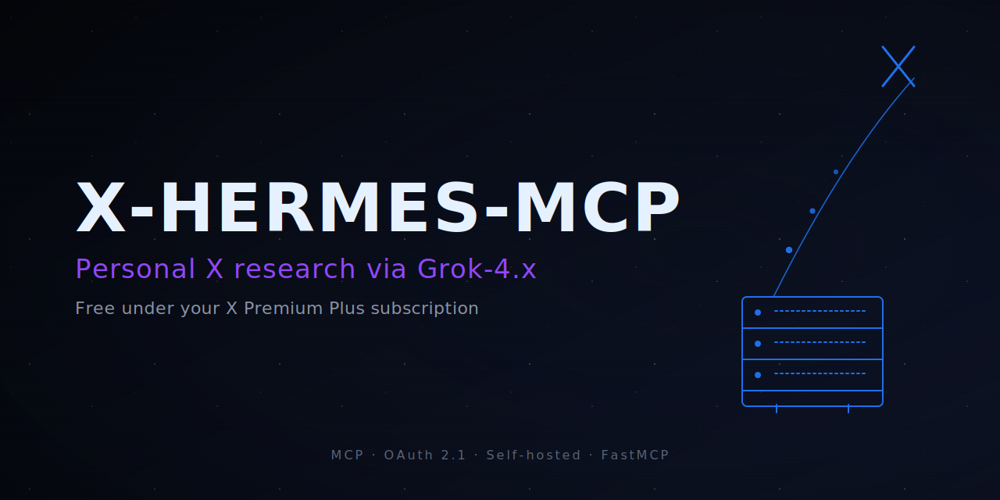
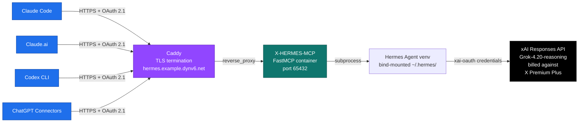

<p align="center">
  
</p>

# X-HERMES-MCP

[](https://modelcontextprotocol.io/)
[](https://x.ai/)
[](#client-setup)
[](#license)

> **Personal X (Twitter) research as an MCP server — 6 tools backed by Grok-4.x `x_search`, no per-call API charge if you already have X Premium Plus.**

**Read this in:** [English](README.md) · [日本語](README.ja.md)

Built to be reachable from **Claude Code · Claude.ai · Codex CLI · ChatGPT Connectors** via OAuth 2.1 over HTTPS, with a self-hosted Caddy + Docker deployment behind a DDNS subdomain.

---

## 30 seconds: what you get

Drop one entry into your MCP client config:

```json
{
  "mcpServers": {
    "X-HERMES-MCP": {
      "url": "https://your-host.example.com/mcp"
    }
  }
}
```

Then ask your agent things like:

- *"Fetch this tweet and give me the structured metrics."* → `fetch_tweet` returns `{text, author, created_at, metrics, media, referenced_tweets, link_card, …}` in ~30 s
- *"What's trending in Japan right now with evidence?"* → `get_trends` returns ranked list with category and evidence URLs
- *"How is this post being quoted? Sample 10."* → `get_quote_tweets`
- *"Search X for `claude code` from `@AnthropicAI`, last 7 days."* → `search_tweets` with structured `allowed_x_handles` / `from_date` / `to_date`
- *"Show me the quote chain rooted at this tweet, depth 2."* → `fetch_tweet_chain`
- *"Just answer a question with X citations, no schema fuss."* → `x_search` (raw, fastest)

All requests go to **xAI Responses API** through your existing OAuth, so usage hits **your Premium Plus quota** instead of a metered developer key.

---

## How it compares

| Approach | Per-call cost | Auth surface | Schema | Latency (typical) |
|---|---|---|---|---|
| Official X API v2 (pay-per-use) | $ per call, tiered | Developer keys, OAuth 1.0a | Hand-rolled | Fast (<5 s) |
| ConnectC2X (sibling repo, commercial) | Same X API metering | OAuth 2.1 over HTTPS | Strict, normalized | Fast (<5 s) |
| Direct `xAI` Responses API (with API key) | Token-metered | `XAI_API_KEY` | Raw `{answer, citations, …}` | 30–45 s |
| **X-HERMES-MCP (this repo)** | **$0 extra over Premium Plus** | OAuth 2.1 + Premium Plus user OAuth | Raw **or** ConnectC2X-compatible | 27–86 s |

**Pick this** if you already pay for X Premium Plus and want a private MCP that doesn't burn a separate metered key. **Pick ConnectC2X** if you need sub-5 s latency and exact-count tools like `count_tweets` / `get_retweeted_by` / `get_list_tweets`.

---

## Tools exposed

| Tool | Backend | Response | Schema |
|---|---|---|---|
| `x_search` | Raw xAI Responses API | **~30–45 s** | Raw `{answer, citations, inline_citations, …}` |
| `fetch_tweet` | Raw x_search + Python mapper (V4) | **~28 s** | ConnectC2X-compatible single tweet |
| `search_tweets` | Raw + structured params (V4) | ~82 s | List of normalized tweets |
| `get_trends` | Raw + JSON mapper (V4) | ~86 s | Trend list with category and evidence URLs |
| `get_quote_tweets` | Raw + `excluded_x_handles` (V4) | ~86 s | Quote sample with `source_total_quotes` |
| `fetch_tweet_chain` | Composes `fetch_tweet` recursively | ~60 s @ depth 2 | Tree of normalized tweets |
| `generate_image` | xAI `grok-imagine-image` via OAuth | ~5–20 s | `[ImageContent, user-text, json]` with stable `permanent_url` |

V4 backends bypass Grok-4.3 synthesis and call the Responses API directly — deterministic output, ISO 8601 timestamps, exact integer metrics, `source: "x_search_raw_v4"` provenance tag. `generate_image` POSTs to `api.x.ai/v1/images/generations` directly with the same OAuth bearer, so SuperGrok / Premium Plus quota is the only billing path. The image is also cached on this server and served from `https://<host>/images/<uuid>.jpg` (30-day retention) — both Claude.ai web and ChatGPT silently drop inline `ImageContent` blocks (anthropic/claude-ai-mcp #238 / openai community #1375446), so the stable URL is the user-facing artifact while the inline bytes are kept for the LLM's own vision review. See [`DOCS/plan.md`](DOCS/plan.md) for the full evolution from V3 wrap to V4 raw and the image-display work-arounds.

---

## Architecture



OAuth 2.1 provider is SQLite-backed (DCR / auth_code / access_token / refresh_token), gated by a single master-password consent screen for solo use. Refresh-token rotation includes a 60-second grace window, and the HTTP transport is stateless — so client races and container restarts don't push you back to the consent page.

---

## Client setup

See [`DOCS/plan.md`](DOCS/plan.md#phase-6--oauth-21-化-claudeai--chatgpt-対応2026-05-18-完了) for the OAuth flow. Short version:

1. Add the `url`-only entry above to your client (no bearer token).
2. On first call, your browser opens a consent page → enter master password.
3. The client stores the access + refresh tokens; subsequent calls are silent.

To avoid duplicate tool listings against ConnectC2X, deny overlapping tools on the client side. Example for Claude Code (`~/.claude/settings.json`):

```json
{
  "permissions": {
    "deny": [
      "mcp__connectc2x__search_tweets",
      "mcp__connectc2x__search_tweets_all",
      "mcp__connectc2x__fetch_tweet",
      "mcp__connectc2x__fetch_timeline",
      "mcp__connectc2x__get_quote_tweets",
      "mcp__connectc2x__get_trends"
    ]
  }
}
```

Leave `count_tweets` / `get_retweeted_by` / `get_list_tweets` enabled — those still go through the metered X API path.

---

## Self-hosting

Requires: Docker, Hermes Agent v0.14.0 installed on the host, xAI OAuth completed (`hermes auth status xai-oauth` → `logged in`), Caddy as reverse proxy, and a DDNS subdomain pointing at the host.

```sh
git clone https://github.com/kitepon-rgb/HermesAgent.git
cd HermesAgent
cp .env.example .env       # then chmod 600 and fill MCP_ADMIN_PASSWORD, X_HERMES_MCP_BASE_URL, OAUTH_DB_PATH
docker compose up -d --build
```

Then add a Caddy block similar to [`DOCS/plan.md`](DOCS/plan.md#caddy-設定-license-servercaddyfile-の末尾に追記) and reload Caddy.

If your router doesn't support hairpin NAT, add the DDNS hostname to `/etc/hosts` on LAN clients pointing at the host's LAN IP.

---

## Why this exists

ConnectC2X (sibling repo) is a commercial MCP that exposes the official X API v2 — strict schemas, sub-5 s latency, but it bills per call. For **personal** X research, paying twice (Premium Plus *and* metered developer API) is wasteful. Hermes Agent already routes Grok's `x_search` tool through Premium Plus OAuth, so a thin MCP wrapper unlocks 5 search functions for **$0 incremental cost**.

The remaining 3 functions (`count_tweets` / `get_retweeted_by` / `get_list_tweets`) genuinely need the v2 API and stay on ConnectC2X. Both servers run side by side; clients choose by tool name.

<details>
<summary><b>Phase history (Phase 1 → 7)</b></summary>

- **Phase 1–3**: Hermes auth, structured prompts (V3), FastMCP server with 5 tools (Grok-mediated wrap).
- **Phase 4**: Docker + Caddy + DDNS deployment, static bearer auth.
- **Phase 6**: OAuth 2.1 (SQLite-backed, master-password consent) — required for Claude.ai / ChatGPT Connectors discovery.
- **Phase 7**: Raw `x_search` path added (P1), then `fetch_tweet` / `search_tweets` / `get_quote_tweets` / `get_trends` all migrated to raw V4 backends (P2 / P3). `fetch_tweet_chain` inherits the speedup (P4). 3–5× faster, deterministic output, ISO 8601 timestamps.

Full breakdown with timings and design decisions in [`DOCS/plan.md`](DOCS/plan.md).

</details>

---

## Project rules

Read [`CLAUDE.md`](CLAUDE.md) before contributing — it lists the absolute rules (secrets handling, billing-path discipline, coding discipline).

## License

Personal project. No license declared — treat as proprietary unless / until this changes.
